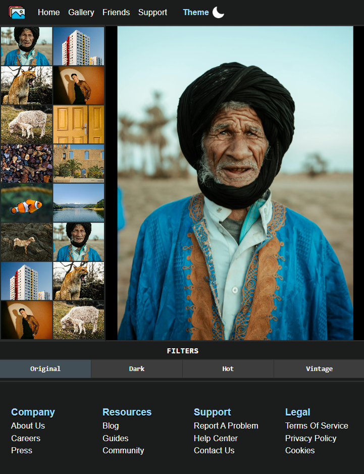

# gallery-webpage
A gallery that allows you to browse, enlarge, apply filters to images(NOTE: this isn't a complete app, it is just a preview page of the concept).

This concept is inspired of [MDN tutorials](https://developer.mozilla.org/en-US/docs/Learn_web_development/Core/Scripting/Image_gallery).

Icons have been downloaded from [FLATICON](https://www.flaticon.com/).  

[Live Demo](https://wdataw.github.io/gallery-webpage/)

## Features:
- Mobile-first responsive design.
- User-friendly design.
- Available dark/light modes.  
- Browse through images.
- Enlarge chosen image.
- Apply filters to images.

## Built With:
- html.
- css.
- Javascript.
